# LookAtMe!

Nama Anggota Kelompok :
1. Fachirah Hestiana Rachmawati (G64180021)
2. Irsyad Musyaffa (G64180048)
3.  Muhammad Faishal Mumtaz (G64180093)

## Latar Belakang

Seringkali kita melihat hewan terlantar atau tak terawat. Ada juga kasus yaitu seseorang yang memelihara hewan tetapi dia memiliki kendala seperti biaya sehingga tidak dapat merawat hewannya lagi. Akhirnya hewan yang ia pelihara ia terlantarkan begitu saja. Atau kasus lainnya seperti hewan-hewan yang semakin hari semakin langka akibat ulah tangan-tangan yang tidak bertanggung jawab. Sudah sepatutnya kita sebagai manusia juga peduli terhadap makhluk hidup lainnya. Oleh karena itu, kami sebagai mahasiswa ilmu komputer ingin membantu menangani masalah tersesebut dengan membuat aplikasi dengan fitur utama yaitu donasi dan adopsi.

## Tujuan
Mempermudah pemelihara hewan untuk mengadopsi hewannya dan membantu keselamatan hewan-hewan yang sakit atau terawat serta diambang kepunahan.

## Ruang Lingkup
Ruang lingkup aplikasi ini :
* Aplikasi fundrising khusus untuk hewan
  + Aplikasi untuk memberi bantuan dana kepada hewan yang sakit atau hal lainnya yang perlu dibantu.
* Aplikasi adopsi hewan
  + Aplikasi untuk adopsi hewan agar meminimalisir hewan tak terurus.

## Deskripsi perangkat lunak
Aplikasi ini mempunyai 2 fitur utama yaitu donasi dan adopsi. Semua orang dapat menggunakan aplikasi ini. Donasi hewan dapat dilakukan jika

## Analisis user (user profile)
User dari aplikasi yang kami buat yaitu masyarakat, siapa pun bisa menggunakan aplikasi ini.

## User story
- Sebagai masyarakat saya dapat memposting data mengenai hewan untuk diadopsi
- Sebagai masyarakat saya dapat melihat data hewan yang akan diadopsi
- Sebagai masyarakat saya dapat mendonasikan dana untuk hewan yang perlu ditolong
- Sebagai masyarakat saya dapat memposting data hewan yang sakit untuk penggalangan dana
- Sebagai masyarakat saya dapat chatting dengan user lainnya untuk keperluan adopsi

## Use case diagram
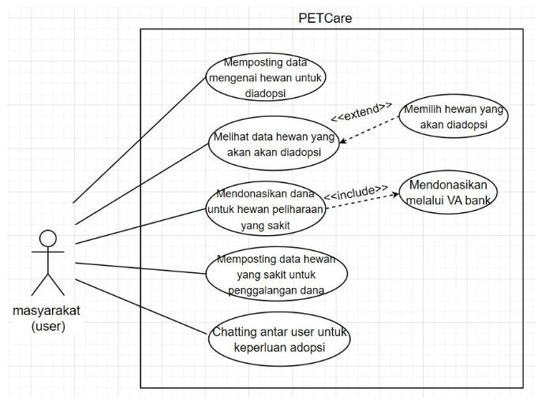

## Use case description
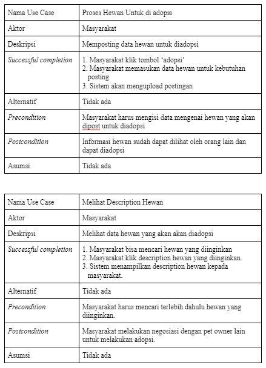
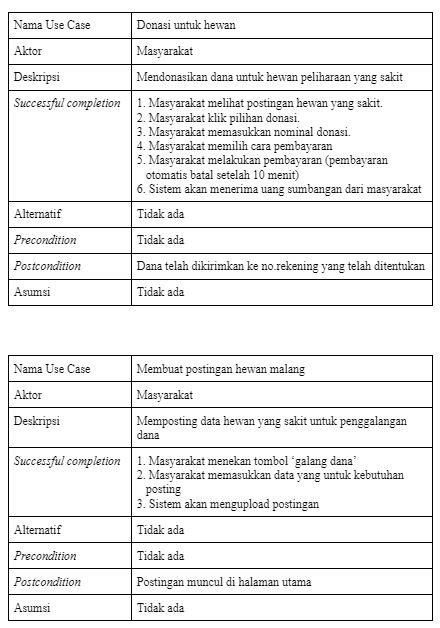
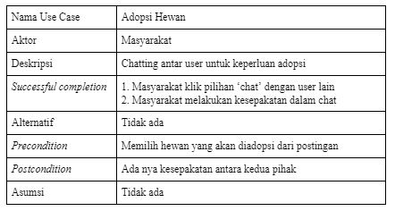

## Activity diagram
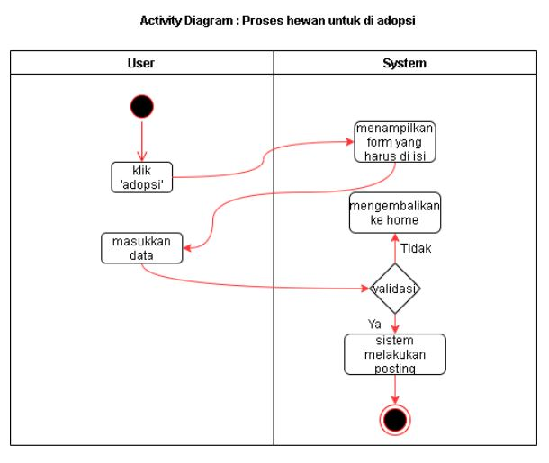
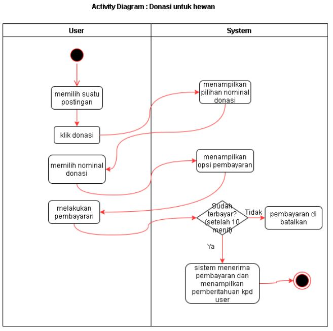
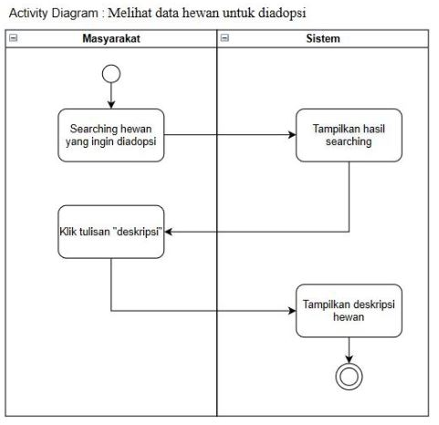
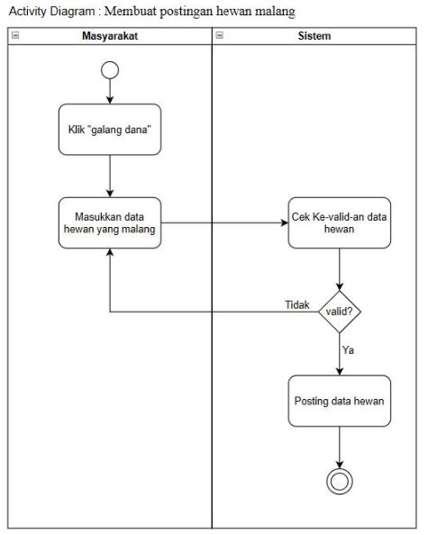
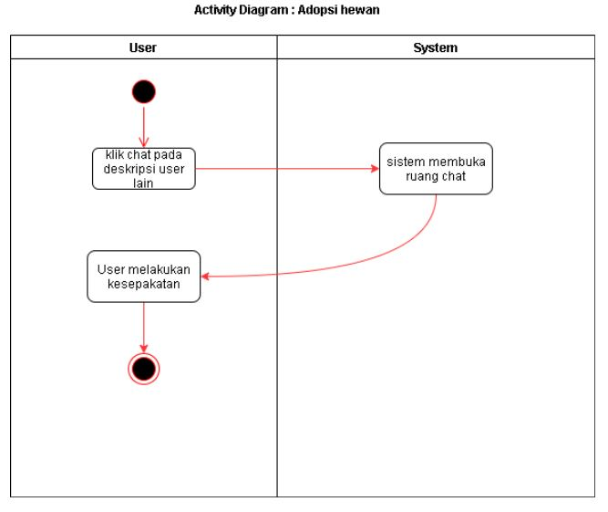

## Gantt chart
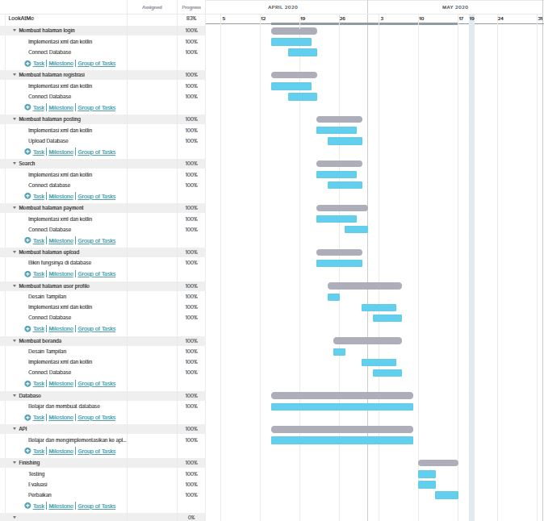

## ERD
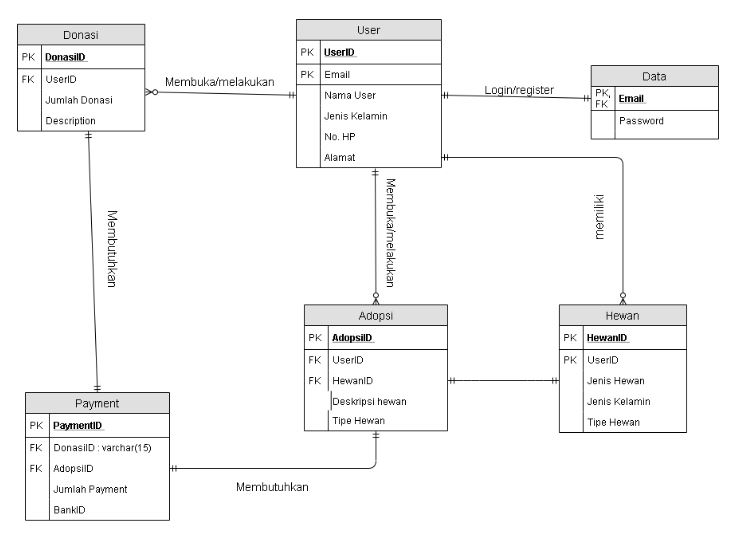

## Hasil implementasi perangkat lunak
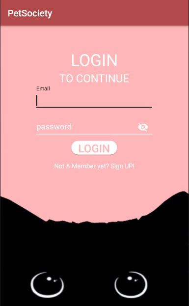
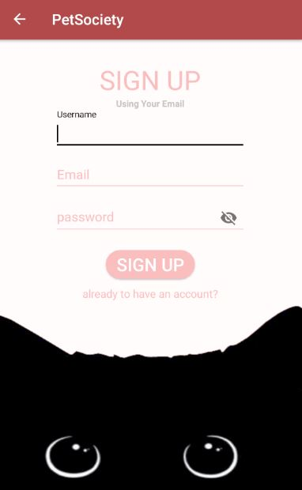
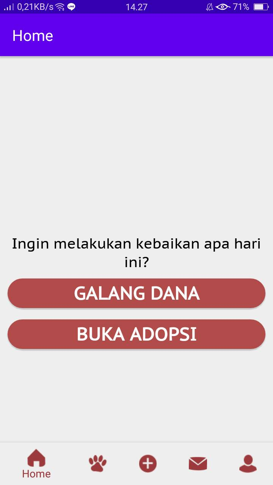
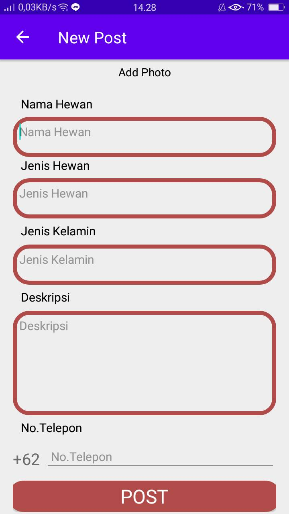
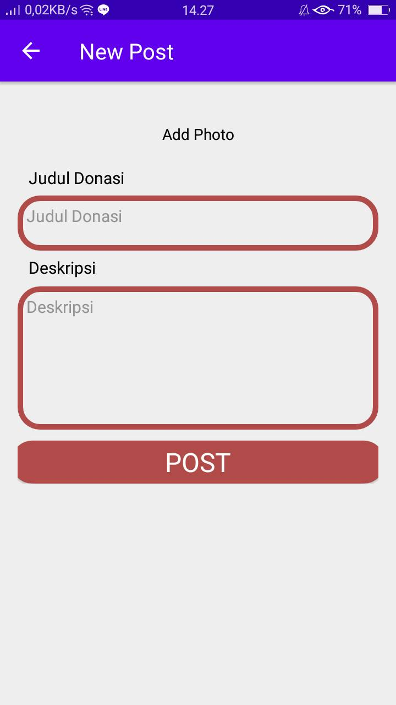
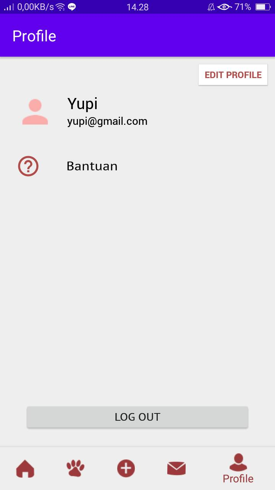

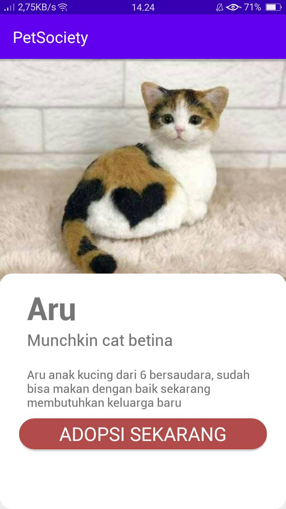
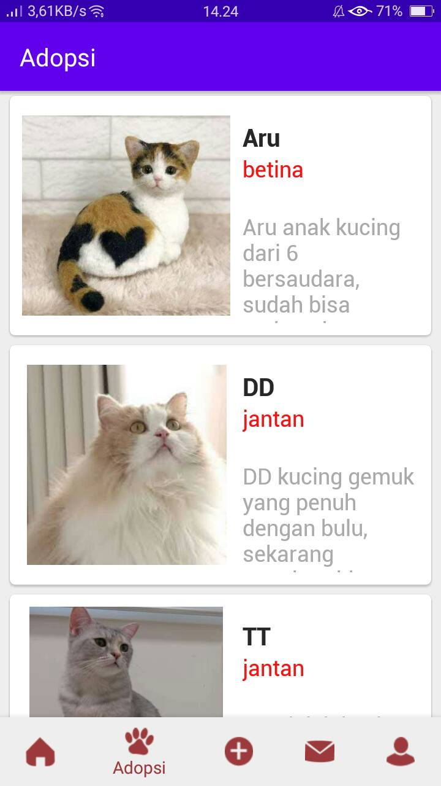
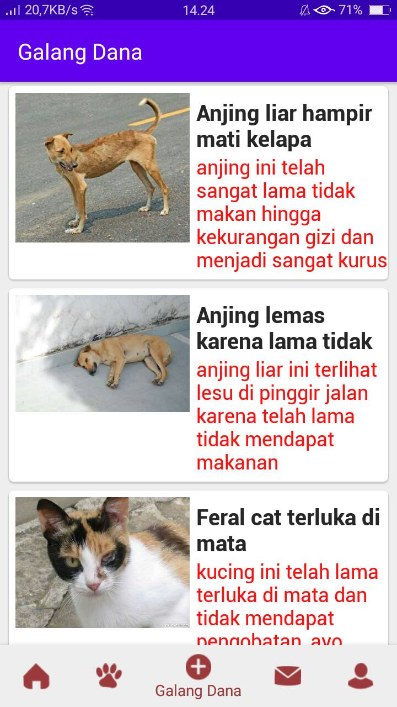
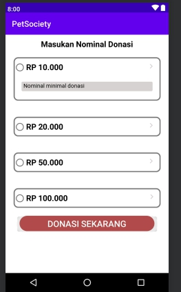

